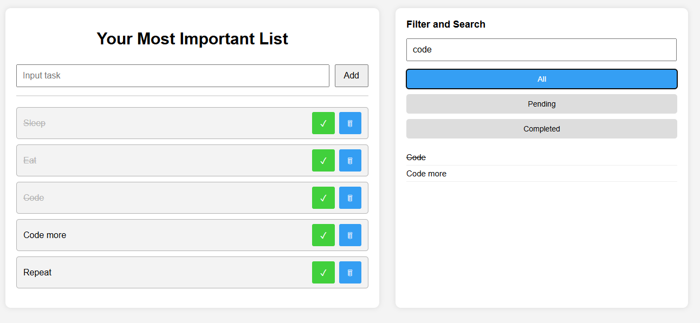

# PROJECT 0. SIMPLE TO-DO LIST

A minimalist To-Do List built with HTML, CSS and JavaScript.
This project was created for learning purposes to practice basic frontend skills: DOM manipulation, event handling, localStorage and data filtering.

---

## Project Goal

- Practice working with HTML, CSS and Vanilla JS
- Learn how to locally store data in browser and manipulate it
- Understand how to organize a simple UI with dynamic elements
- Get hands-on experience with Git and GitHub

---

## Features

- Add new tasks
- Mark tasks as completed
- Delete tasks
- Quick text-based filtering
- Tasks are saved in the browser (localStorage)

---

## Technologies

- HTML5
- CSS3
- JavaScript (Vanilla JS)
- LocalStorage

## How to Run

1. Clonse the repository:
```bash
git clone https://github.com/323535/todo-list.git
```
2. Navigate to the project folder:
```bash
cd todo-list
```
3. Open `index.html` in your browser
> The project is fully frontended, no server is required.

## Preview

